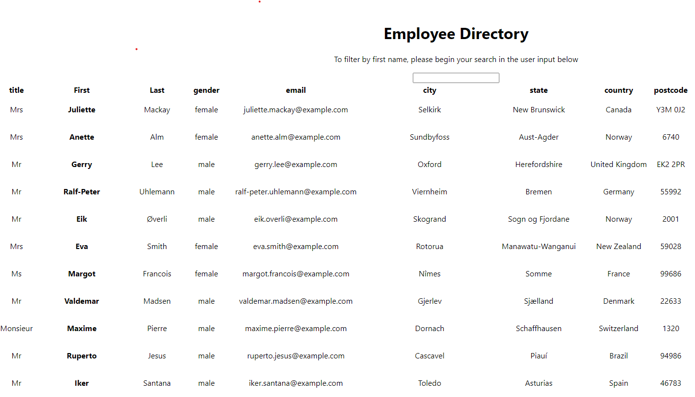

# Employee Directory

This app allows the user to view the entire employee directory at once to have quick access to their information. 

Given a table of random users generated from the Random User API, when the user loads the page, a table of employees should render.

The user should be able to:

    Sort the table by at least one category

    Filter the users by at least one property.

